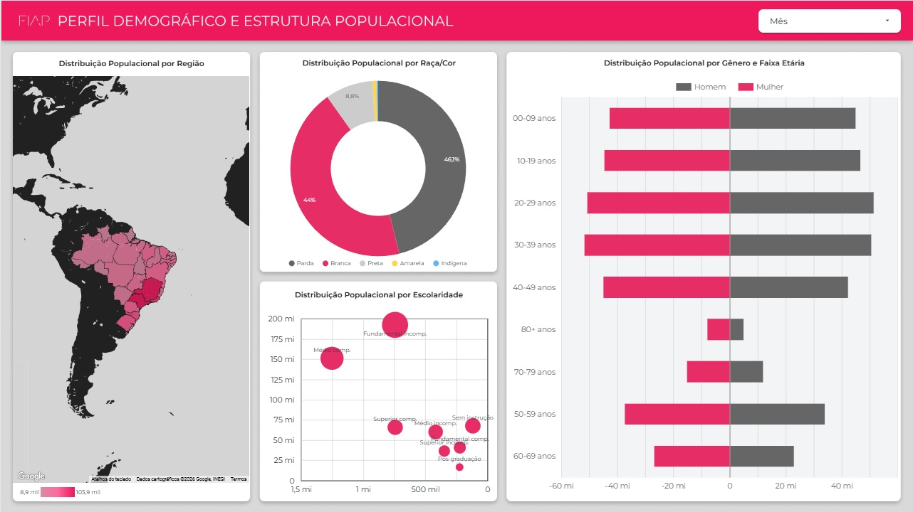
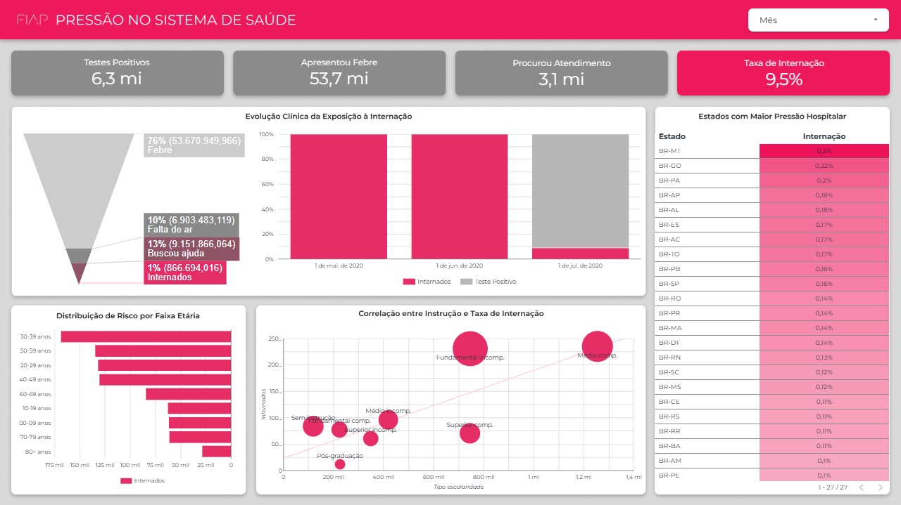
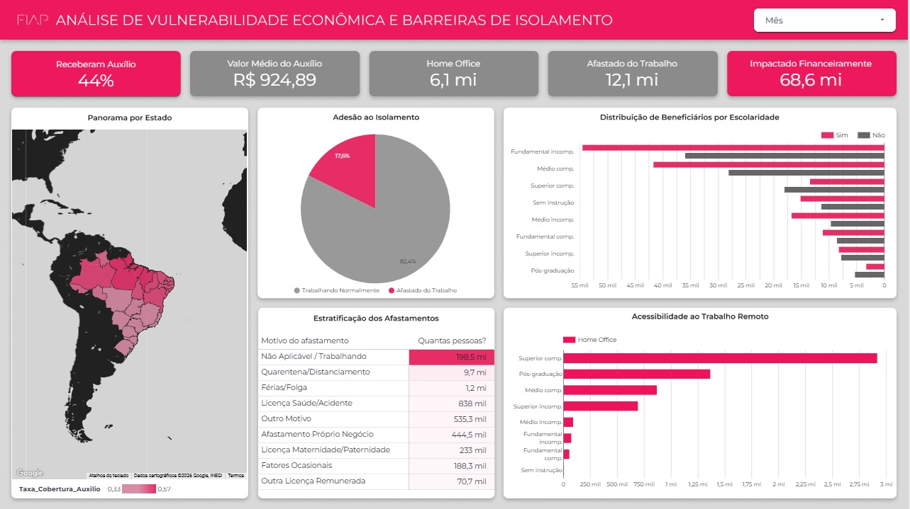

#  Tech Challenge - Inteligência de Dados PNAD-COVID-19
**Fase 3: Data Analytics & Engenharia de Dados na AWS**

Este projeto foi desenvolvido como parte do Tech Challenge da Fase 3, simulando a contratação como **Expert em Data Analytics** por um grande grupo hospitalar. O objetivo é estruturar um pipeline de dados robusto para analisar o comportamento populacional durante a pandemia e gerar indicadores estratégicos para o planejamento de futuros surtos.

## 🏗️ Arquitetura da Solução (Data Lakehouse)

Implementamos uma arquitetura de **Data Lakehouse** utilizando serviços da **AWS**, seguindo o padrão **Medallion Architecture** (Bronze, Silver e Gold).

### Stack Tecnológica
* **Análise Exploratória (EDA):** Python & PySpark (Google Colab).
* **Armazenamento:** Amazon S3 (Data Lake).
* **Catálogo de Dados:** AWS Glue Crawler.
* **Processamento e ETL:** AWS Athena (Presto SQL).
* **Visualização de Dados:** Google Looker Studio.

## 🛠️ O Pipeline de Dados

### 1. Camada Bronze (Raw)
* Ingestão dos microdados brutos do IBGE no **Amazon S3**.
* Execução do **AWS Glue Crawler** para descoberta automática de esquema e criação do Data Catalog.

### 2. Camada Silver (Refined & Cleaned)
Nesta fase, realizamos o tratamento crítico dos dados via **AWS Athena**.
* **Tratamento de Data Quality:** Identificamos um desalinhamento de colunas (*Schema Drift*) nos arquivos originais.
* **Solução:** Aplicamos um remapeamento manual via SQL, garantindo a integridade dos dados.
* **Renomeação de Negócio:** Substituímos nomes técnicos (ex: `A002`) por nomes descritivos (ex: `idade`).

### 3. Camada Gold (Analytics)
* Os dados refinados e otimizados em formato **Parquet** alimentam dashboards executivos no **Looker Studio**.

Link: https://lookerstudio.google.com/reporting/c6dfb578-809e-4ca0-b81f-30347d71f218

## 📋 Seleção das 20 Variáveis Estratégicas

Selecionamos as 20 variáveis de maior impacto clínico e econômico, divididas em:
* **Identificação:** Peso Amostral (V1032), Mês (V1013), UF.
* **Demografia:** Idade (A002), Sexo (A003), Raça (A004), Escolaridade (A005).
* **Sintomas:** Febre (B0011), Tosse (B0012), Falta de Ar (B0014), Perda de Olfato/Paladar (B00111).
* **Sistema de Saúde:** Internação (B005), Resultado do SWAB (B009B).
* **Economia:** Ocupação (C001), Home Office (C013).

## 📊 Visualização e Insights (img_dash)

Abaixo, alguns dos indicadores gerados para suporte à decisão hospitalar:

| Visão Geral do Dashboard | Análise de Sintomas vs Internação | Vulnerabilidade Econômica |
|:---:|:---:|:---:|
|  |  | 

## 📁 Estrutura do Repositório
* `/sql`: Scripts de criação das tabelas no Athena.
* `/notebooks`: Arquivo `.ipynb` contendo a EDA em PySpark.
* `/img_dash`: Capturas de tela dos dashboards.
* `/docs`: Relatório técnico final.

## 👤 Autor
**Joe Allan Zirn**
* GitHub: [J034ll4n](https://github.com/J034ll4n)
* LinkedIn: [[Seu Link do LinkedIn]](https://www.linkedin.com/in/joe-allan-zirn-2bb0b62b1/)
